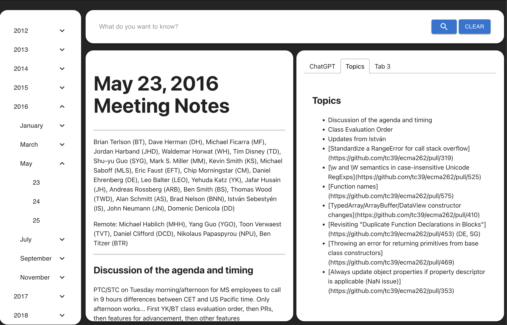

# ZINF-TC39

## About the project

We were given the task of making the meeting notes of tc39 more readable and accesable.
This application exist to make it easier to view meeting notes from the tc39 meetings.

## How to run / Installation

This is how to run the project now, might change later.
After you have cloned the project you can write "npm i" in console
Afterwards it should be possible to run the app, if something is missing just write "npm i "Name of missing""

To start:
"npm run dev"

## Tech/Framework used

TODO:

- React
- Built with:
  - [Electron](https://www.electronjs.org/)
  - [MUI](https://mui.com/)

## API Reference

TODO:

## Resources

TODO:
Our [agile project board](https://trello.com/b/vpTSGlQt/zinf-tc39).

## Screenshots

TODO:

## Credits

TODO:
