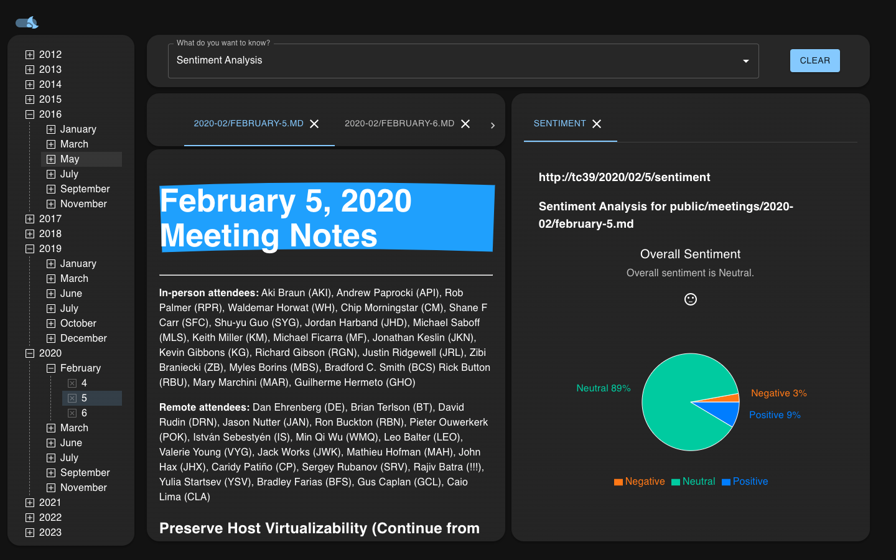

# ZINF-TC39 (In development)

## About the project

We have been tasked with improving the accessibility and readability of the TC39 meeting notes. Our application simplifies the process of viewing these notes. We've organized all meeting documents into a tree structure, making it easier to find specific files. Additionally, we've incorporated a sentiment analysis tool. This feature allows users to select portions of text and analyze their sentiment. We've also integrated the ChatGPT API. Now, users can engage in conversations with context from the marked sections of the markdown (MD) files.

## Getting Started

### Prerequisites

Ensure you have the following installed:

- [Python](https://www.python.org/downloads/)
- [Node.js](https://nodejs.org/en/download/)
- [pip](https://pip.pypa.io/en/stable/installation/)

### Installation

Clone the repository and install dependencies:

```sh
git clone https://github.com/INF218-Group-Project/TC39-Meeting-Minutes-Viewer
cd TC39-Meeting-Minutes-Viewer
npm install
```

If you encounter a notification about missing components,
use the command 'npm i [Name of Missing Component]' to install them individually.

### Example:

```java
pip install stanza
```

To install what is needed do this:

```java
npm i
```

### Configurtion - Insert Chatgpt API

This application uses ChatGPT API. If you want to have these features, which is recommended for the full experience of the application, please do as follows:

Obtain a ChatGPT API key and insert it into the ".env_sample.txt".
After the key has been insertet the file name needs to be changed to ".env.txt"

Chat API should now work.

### Running the Application

Start the application in development mode:

```Java
npm run dev
```

## Tech/Framework used

TODO:

- Built with:
  - [React](https://react.dev/)
  - [Electron](https://www.electronjs.org/)
  - [MUI](https://mui.com/)

## API Reference

TODO:

## Resources

https://nodejs.org/en/download
https://pip.pypa.io/en/stable/installation/
https://www.electronjs.org/
https://react.dev/
https://www.python.org/
https://www.typescriptlang.org/
https://www.javascript.com/
https://openai.com/

TODO:
Our [agile project board](https://trello.com/b/vpTSGlQt/zinf-tc39).

## Screenshots

<table>
  <tr>
    <td>
      <p align="center">Light Mode</p>
      
    </td>
    <td>
      <p align="center">Dark Mode</p>
      
    </td>
  </tr>
</table>

## Credits

in alphabetical order:

_Brage Aasen_

_Casper Benjamin Karlsen_
s
_Elias Hovdenes_

_Magnus Brorby_

_Vetle Knutsen_
